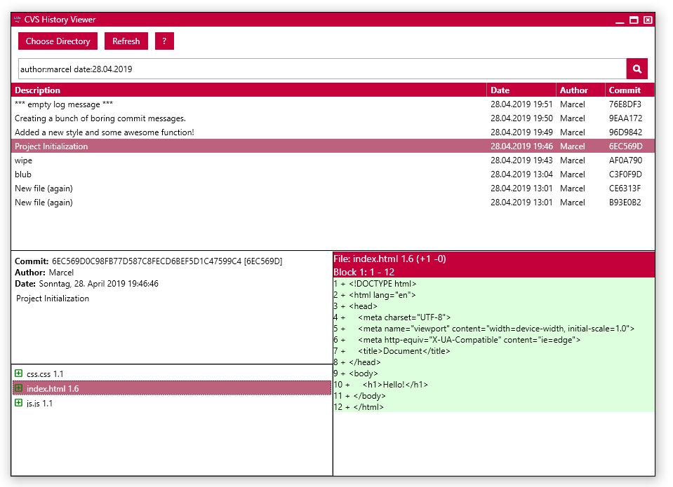

# CVS History Viewer

**View CVS repositories in a git-like kind of way!**

Simply choose a directory and the app is going to scan all the CVS commits for all files in that folder. Afterwards it will display everything in a git-like kind of way, meaning that the view is centered around commits and not file revision.

## Search through all commits with some simple keywords!

You can use a number of simple keywords, to filter down the commits as much as you like.

| Keyword | Description | Example |
| ------------- | ------------- | ------------ |
| commit | ID/hash of the commit. | commit:6EC569D |
| author  | Name of the one that committed the change. | author:Marcel |
| file  | Show commits related to this file name.  | file:readme.md |
| date  | Show commits done on a specific day.  | date:24.09.2019 (use your regional date format) |
| from  | Show commits starting from this date.  | |
| to  | Show commits done before and including this date. | |
| limit  | Overwrite default limit of 220 commit search results. This will have negative effects on performance. | limit:400 |

**And of course you can use the "*" wildcard!**